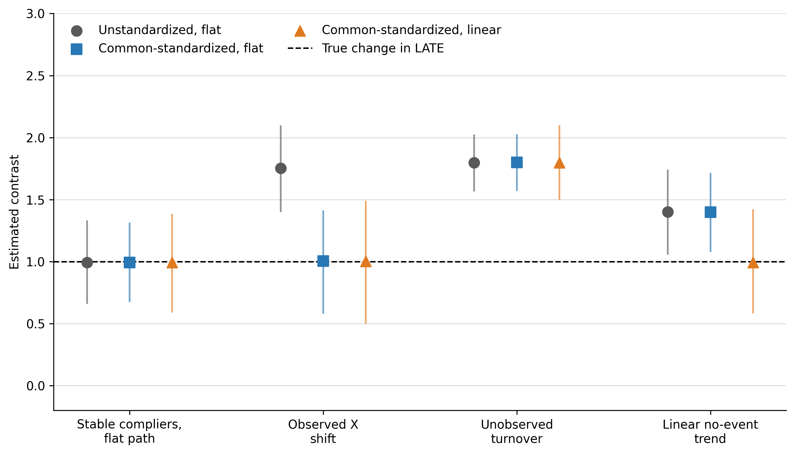

## Summary

Suppose a hospital is acquired and researchers want to learn whether the acquisition changed the effect of receiving care there. A direct comparison with patients treated elsewhere is difficult because hospital destination is not random. Ambulance dispatch provides a possible instrument: otherwise similar patients may be assigned to companies with different hospital preferences, which shift the hospital that initially receives them (Doyle et al. 2015).

A natural design estimates the ambulance IV before and after the acquisition, then compares the two Wald ratios. Each ratio can identify a local effect for patients whose hospital destination responds to the instrument in that period. Their difference becomes an event effect only after three additional links are made. The estimates must refer to a common target population and comparable local populations across periods and event paths. The design must also specify how the LATE would have evolved after the acquisition date without the acquisition.

This guide develops those links and shows what remains informative when they are uncertain. Under a stable-complier benchmark and a flat no-event path, the event effect equals the standardized post-event Wald ratio minus the standardized pre-event Wald ratio. Weaker population links and alternative continuations require explicit assumptions and often lead naturally to sensitivity analysis. The framework therefore separates what the period-specific IVs identify from what supports a causal event interpretation.

## 1. The nested event problem

### 1.1. Roles of the event and instrument

Consider a hospital acquired at a known date. Acquisition is the upper-level event, and emergency patients are the lower-level units. Let $D=1$ denote initial care at the focal hospital. Let $D=0$ denote a declared alternative, such as one comparison hospital or a fixed distribution of eligible hospitals. Let $Z$ denote ambulance-company assignment or a fixed encouragement derived from company preferences.

Ambulance assignment shifts hospital exposure within a period. Acquisition may change the care delivered by the focal hospital, the alternatives available to patients, or both. Thus $Z$ instruments $D$; the event effect comes from comparing local exposure effects across event paths.

Fuzzy or instrumented DiD uses a policy or group change to generate the instrument (de Chaisemartin and D'Haultfœuille 2018; Miyaji 2024). Here, a lower-level IV identifies exposure effects within each period. The event changes the environment across which those effects are compared.

\Needspace{0.62\textheight}

**Figure 1. The event and the lower-level IV play different causal roles**

{width=88%}

*Notes:* The lower-level IV shifts exposure within a period. The upper-level event may change both the exposure process and the effect of exposure. Exclusion rules out an effect of $Z$ on $Y$ through channels outside the declared exposure.

The same structure appears in other settings. Workers may sort across establishments after a workplace policy. Families may choose among schools that adopt programs. Cases may be assigned across courts during an institutional reform. In each example, a lower-level instrument addresses exposure choice. An event changes the environment in which that exposure operates.

### 1.2. Target population and intervention definitions

Start with an event-invariant rule that assigns lower-level units to an upper-level target. Call the resulting set the **target universe**. For a hospital, this might be all eligible emergency patients originating in prespecified pickup areas around the hospital. The rule covers patients ultimately taken elsewhere as well as those treated at the focal hospital.

Membership is determined before ambulance assignment. This timing avoids defining the study population by realized destination—the exposure shifted by the instrument. Predetermined market, cohort, or source-population indicators can refine the target. Realized-provider fixed effects instead condition on an endogenous response. They may absorb the first stage or select patients on unobserved determinants of outcomes. Konetzka, Yang, and Werner (2019) discuss the related problem of using a patient-level instrument to study a provider-level attribute.

Stable intervention definitions matter just as much. The two values of $Z$ should represent the same encouragement in each period. Likewise, $D=1$ and $D=0$ should describe the same exposure contrast. If the comparison group combines several hospitals, changes in their mixture may alter the meaning of $D=0$. Researchers can address that problem by fixing the alternative-provider distribution, defending version irrelevance, or defining a richer exposure.

Eligibility and outcome observation may vary over time, so the records can form repeated cross sections rather than a panel. State the observation rule alongside the target universe. In particular, exposure-induced survival, attrition, or missingness changes who contributes an observed outcome and requires a separate selection analysis.

## 2. Identification of the event effect

### 2.1. Period-specific local average treatment effects

Let $t=0$ denote a pre-event period and $t=1$ a post-event period. For predetermined covariates $X=x$, the conditional Wald ratio is

\[
\beta_t(x)=
\frac{E[Y\mid Z=1,X=x,t]-E[Y\mid Z=0,X=x,t]}
{E[D\mid Z=1,X=x,t]-E[D\mid Z=0,X=x,t]}.
\tag{1}
\]

Call the numerator $\rho_t(x)$ and the denominator $\pi_t(x)$. Under the usual binary-IV conditions, $\beta_t(x)$ is the exposure LATE for period-$t$ compliers (Imbens and Angrist 1994). The conditions are independence, exclusion, monotonicity, overlap, a positive first stage, and a suitable observation process. Assess them in every period used by the event design. Report the instrument propensity, reduced form, first stage, and strength evidence by period. A pooled first stage can hide a weak component.

### 2.2. Common standardization and sampling

Raw Wald ratios can change because the covariate distribution of compliers changes. Choose a reference distribution $F_X^\star$ before looking at outcomes and average the conditional ratios over its common-support domain:

\[
\beta_t^\star=E_{F_X^\star}[\beta_t(X)],
\qquad
\Delta^{IV,\star}=\beta_1^\star-\beta_0^\star.
\tag{2}
\]

A useful default is the covariate distribution of pre-event compliers. Using the observed pre-event distribution $F_{X0}$, the reference measure is proportional to $\pi_0(x)dF_{X0}(x)$. Restrict it to strata that support both period-specific ratios. Choosing another policy-relevant distribution is equally coherent, provided the choice and any trimming are reported.

Standardization aligns the observable mix. A **sampling bridge** then connects observed compliers to compliers in the target universe. One practical version equates their conditional mean exposure effects within $X$. That bridge requires positive observation probability in the target strata. It also requires an exclusion argument that extends beyond the analyzed records. Applications with selective survival or attrition will often need a more explicit model or sensitivity analysis.

### 2.3. Stable compliers and the no-event path

Even after standardization, $\Delta^{IV,\star}$ may compare different local populations. The benchmark defines **stable compliers** using three response conditions. Their exposure responds to the instrument before the event. It also responds after the event under both the observed and no-event paths. Stability can be imposed as equality of these complier sets. A weaker route allows membership to change. It instead carries the relevant conditional mean exposure effects across the changing groups. Sections B.2 and B.3 formalize the two routes.

The second link concerns the missing post-event counterfactual. Let $L_1^{E,S,\star}$ be the post-event LATE under the event. Let $L_1^{0,S,\star}$ be the LATE that would have prevailed at the same date without it. Both terms use stable compliers and the reference covariate distribution. The event target is

\[
\theta^{S,\star}=L_1^{E,S,\star}-L_1^{0,S,\star}.
\tag{3}
\]

Only the first term is observed after the event. A flat benchmark sets the missing term equal to the comparable pre-event LATE. Several pre-event estimates can instead support a prespecified linear continuation or bounds on plausible departures. Whichever rule is chosen, it concerns a path of LATEs—not a trend in average untreated outcomes.

No anticipation gives pre-event estimates their counterfactual meaning. Announcements, preparation, or early changes in ambulance behavior can contaminate periods near the acquisition date. In that case, use an earlier reference period or redefine the transition window.

\Needspace{0.58\textheight}

**Figure 2. The observed IV path leaves one counterfactual LATE missing**

{width=88%}

*Notes:* The factual pre-event and post-event Wald ratios identify period-specific local effects under their respective IV conditions. An event interpretation also requires a common local population. It further requires a continuation for the post-event LATE under the no-event path. The dashed line is schematic; applications may use a flat, linear, or bounded continuation.

With stable compliers, a valid sampling bridge, and a flat no-event path, the standardized before-and-after change identifies the target:

\[
\boxed{\theta^{S,\star}=\beta_1^\star-\beta_0^\star.}
\tag{4}
\]

Equation (4) is the core result. The Wald ratios provide the two factual local effects. Stable-complier and sampling assumptions place them on a common population, while the continuation supplies the missing no-event term.

### 2.4. Identified causal objects

Different parts of the design support different statements. Table 1 gives the useful hierarchy.

\Needspace{0.38\textheight}

**Table 1. What the design supports at each stage**

\begingroup
\renewcommand{\arraystretch}{1.30}

| Maintained conditions | Supported interpretation |
|---|---|
| Instrument-arm outcome and exposure means are well defined | Reduced forms and first stages |
| Period-specific IV conditions hold | A LATE of exposure for each period's observed compliers |
| Common support, standardization, and a sampling bridge hold | Comparable factual-period LATEs for the declared target |
| The local-population link, no anticipation, and the continuation also hold | Event-induced change in LATE for the declared local population |

\endgroup

If the final row is difficult to defend, the standardized change in factual-period LATEs remains a useful estimand. Its interpretation is narrower: exposure effects changed for the local populations reached by the instrument. That distinction should be set before estimation, along with the preferred event target and fallback.

## 3. Decomposition and sensitivity analysis

### 3.1. Diagnostic decomposition

Three gaps separate the standardized change from the event target. Write

\[
\Delta^{IV,\star}
=\theta^{S,\star}
+\Delta^{0,\star}
+B^{C,\star}
+B^{O,\star}.
\tag{5}
\]

Here $\Delta^{0,\star}$ is the no-event change in LATE for the stable population. The term $B^{C,\star}$ captures changes in the local complier population. The term $B^{O,\star}$ captures changes in the gap between observed and target-universe compliers. This accounting identity organizes the threats specific to the nested-event problem. It starts after the period-specific IV conditions and intervention definitions have been defended.

Each term suggests different evidence. Historical IV estimates speak to $\Delta^{0,\star}$ when they use the same instrument, exposure, target, and local-population link. Covariate balance and common standardization help diagnose observable composition. Changes in first stages reveal how the size of the complier group moves. Similar first stages, however, can accompany substantial entry and exit. Sampling rates, attrition patterns, and outcome-observation audits inform $B^{O,\star}$.

Sensitivity analysis can place joint bounds on the three gaps. If their absolute values are bounded by $h_0$, $h_C$, and $h_O$, then

\[
\theta^{S,\star}
\in
\left[\Delta^{IV,\star}-H,\ \Delta^{IV,\star}+H\right],
\qquad H=h_0+h_C+h_O.
\tag{6}
\]

Joint values are more informative than moving one gap while silently fixing the others at zero. Rambachan and Roth (2023) provide a template for calibrating restrictions on the LATE continuation. Inference must be developed for the resulting IV functional.

### 3.2. Simulation design and results

Figure 3 uses four repeated cross sections around one event. Every scenario has a valid IV in each period, and the true event-induced change in LATE equals one. The simulations separately alter observed covariate composition, latent complier types, and the no-event path.

\Needspace{0.56\textheight}

**Figure 3. Standardization, population links, and continuation address different problems**

*Notes:* Markers show means across 2,000 replications; vertical lines show the 2.5th and 97.5th percentiles. Each period contains 2,500 observations. The dashed line is the true event-induced change in LATE. “Common-standardized” averages over the pre-event complier covariate distribution. “Flat” carries the pre-event LATE forward; “linear” extrapolates from three pre-event LATEs. The accompanying replication materials document the data-generating process, fixed seed, and outputs.

In the stable-complier scenario, all three estimators average about one. Shifting the observed distribution of $X$ moves the raw estimate to 1.75, while common standardization brings it back to 1.00. Latent complier turnover produces an estimate near 1.80 even after standardization because the observable mix remains stable. Finally, a rising no-event LATE makes the flat continuation average 1.40; the correctly specified linear continuation averages 0.99.

These cases isolate the role of each assumption. Standardization handles observed composition, while population links address latent response types. A continuation constructs the missing no-event LATE. Applications need evidence for all three, but the evidence will usually come from different sources.

## 4. Multiple periods and staggered events

### 4.1. Event-time local average treatment effects

With several periods, estimate a standardized Wald ratio at each event time. The resulting path describes how the factual LATE of exposure evolves around the event. Several pre-event points reveal the historical LATE path. They also show how first stages and support change. This evidence can guide a prespecified continuation.

Pre-event estimates remain evidence rather than a direct observation of the missing post-event path. Low-powered pretrend tests offer limited reassurance, and choosing the continuation because one specification passes a test changes the subsequent inference (Roth 2022). A clear design states the reference period, transition window, continuation, and sensitivity range in advance.

### 4.2. Cohort-specific estimation and aggregation

For staggered events, begin with cohort-by-event-time estimates. This follows the group-time discipline used in modern staggered designs (Callaway and Sant'Anna 2021). Within each cohort, calculate the conditional reduced forms and first stages for every upper-level unit. Next form the supported Wald ratios, standardize them, and average across units. This order preserves the target weights. Pooling reduced forms and first stages before taking a ratio creates first-stage-dependent weights. It generally answers a different question.

Next aggregate cohort-specific effects using prespecified weights. A balanced event study retains the same cohort set and cohort weights at every horizon. That fixed mixture improves comparability across event time. Each contributing cohort-period component still needs IV support, sampling support, and a defensible local-population link. When some components lose support, report the unsupported reference mass. Then defend extrapolation or relabel the estimand over the supported set.

Stacked datasets duplicate some original observations across cohort comparisons. Treat those copies as the same sampling information: preserve the original cluster identifiers and rebuild the stacks inside a bootstrap. Calendar-time shocks also deserve attention when they change the exposure contrast, compliance behavior, observation, or instrument validity.

## 5. Estimation, inference, and reporting

### 5.1. Estimation

Before analyzing outcomes, specify the event date, transition window, target-universe rule, instrument construction, and exposure contrast. Also specify the covariates, support rule, reference distribution, sampling bridge, local-population link, and continuation. For staggered designs, add the within-cohort and across-cohort weights.

Estimation then follows Equation (2). Calculate conditional reduced forms and first stages. Form the supported conditional ratios and average them with the declared reference weights. Regression software can recover the primitive contrasts, but the analyst still chooses the target and weighting scheme. A useful implementation check compares the regression output with the direct calculation on the same sample and weights.

A generated instrument should rely on predetermined, event-unaffected information. Fix the training population and dates, construction rule, orientation, cutoff, leave-out unit, and treatment of unsupported inputs. When the score is estimated from analysis-linked data, resampling should rebuild the score along with the rest of the estimator. Leave-out construction removes a mechanical part-whole link; substantive independence and exclusion still come from the institutional argument.

### 5.2. A numerical example

Table 2 shows two covariate groups with reference weights 0.60 and 0.40. The standardized LATE rises from 1.68 before the event to 2.78 afterward, a change of 1.10. Under the full set of conditions in Table 1 and a flat no-event path, 1.10 is the event estimate.

\Needspace{0.43\textheight}

**Table 2. From instrument-arm means to the standardized contrast**

| Period | Group | Reference weight | Reduced form | First stage | Wald ratio |
|---|---:|---:|---:|---:|---:|
| Pre | A | 0.60 | 0.36 | 0.20 | 1.80 |
| Pre | B | 0.40 | 0.24 | 0.16 | 1.50 |
| Post | A | 0.60 | 0.58 | 0.20 | 2.90 |
| Post | B | 0.40 | 0.40 | 0.16 | 2.50 |

The pre-event standardized LATE is $0.60(1.80)+0.40(1.50)=1.68$. The post-event value is $0.60(2.90)+0.40(2.50)=2.78$. Table 1 determines the label attached to their difference. Under the first three rows of that table, 1.10 is the standardized change in factual-period LATEs.

### 5.3. Inference

Component estimates share observations, reference weights, continuations, cohort stacks, and sometimes a generated instrument. Inference should therefore target the assembled contrast. A full-process cluster bootstrap provides a natural strong-identification approach. Resample the original independent units and reconstruct every estimated component. This reconstruction includes the reference distribution, cohort stacks, and generated scores.

Weak first stages require identification-robust inference for the assembled target. Section E.3 gives an executable conservative projection for fixed finite strata, fixed external weights, and a flat continuation. The procedure works with simultaneous intervals for the reduced forms and first stages. It allows the final confidence set to become unbounded when the data do not rule out a zero denominator. Estimated weights, selected support, and staggered aggregation require procedures developed for those larger functionals. If no such procedure is available, report the primitive moments and describe conventional intervals as strong-identification approximations.

Clustering follows the source of assignment and dependence, often ambulance company, market, hospital, or a combination rather than the patient row alone. Few-cluster and weak-IV problems require separate remedies. A wild cluster bootstrap may improve primitive-moment inference with few clusters under its conditions (Cameron, Gelbach, and Miller 2008). Resampling a conventional ratio statistic does not make it identification robust.

### 5.4. Reporting

Readers should be able to reconstruct every reported event estimate. Report the instrument-arm means, reduced forms, first stages, reference weights, and standardized period-specific ratios. Also report support losses, observation rates, retained reference mass, continuation inputs, cohort weights, and the clustering structure. For a generated instrument, describe the training sample and whether inference rebuilds the construction.

The final label should track Table 1. Full support for the identification argument warrants “event-induced change in LATE for stable compliers.” Weaker population or path evidence warrants “standardized change in period-specific LATEs.” Precision describes how much the sample reveals about the chosen estimand.

## 6. Conclusion

A lower-level IV addresses exposure selection within each period, but an event question asks for more than two separately valid IV estimates. The estimates must refer to a common target population and a comparable local population. The analysis must also supply a credible path for how the LATE would have evolved without the event. Treating these requirements as distinct parts of the design clarifies which conclusions come from the data and which depend on assumptions about populations and counterfactual change.

When these links are convincing, the standardized change in Wald ratios has a clear interpretation as an event-induced change in LATE. When the links remain uncertain, period-specific LATEs and sensitivity ranges provide a more defensible account of the evidence. This reporting strategy preserves the value of the IV estimates while making the additional assumptions behind an event interpretation visible to readers.

\vspace{2.2em}

\noindent\rule{0.34\linewidth}{0.4pt}

\vspace{1.0em}

**Suggested citation**

Burla, Sriteja. 2026. *Instrumental Variables in Nested Event Designs: Endogenous Exposure and Changes in Local Average Treatment Effects*. Version 1.0, August 2026.

\newpage

# Technical Supplement

## A. Setup and within-period IV

### A.1. Population, outcomes, and compliers

Fix one upper-level unit and let $\mathcal U$ be its target universe. Membership in $\mathcal U$ is determined before the instrument and the event. Event path $a\in\{0,E\}$ records whether the event occurs. Let $a_0=0$ denote the common pre-event path and $a_1=E$ the factual post-event path.

For lower-level unit $i$ in period $t$, let $D_{it}(a,z)\in\{0,1\}$ be potential exposure under instrument value $z$. Let $Y_{it}(a,d)$ be the potential outcome under exposure $d$. This notation imposes exclusion: once exposure is fixed, the instrument has no further effect on the outcome.

Under the positive orientation, define the complier set and exposure effect as

\[
\mathcal C_t(a)=\{i\in\mathcal U:D_{it}(a,1)>D_{it}(a,0)\},
\qquad
\tau_{it}(a)=Y_{it}(a,1)-Y_{it}(a,0).
\tag{S.1}
\]

Under the usual binary-IV conditions, Equation (1) identifies the conditional mean exposure effect among factual-period observed compliers. This is the standard LATE result (Imbens and Angrist 1994), which the supplement takes as its starting point. Section 2.1 discusses period-by-period validity and reporting.

The indicator $O_{it}$ records that an eligible unit's outcome is observed. The benchmark assumes that observation does not change with the instrument or exposure, conditional on predetermined covariates. If survival, attrition, or missingness responds to either one, the application needs a separate selection argument.

## B. Standardization and event identification

### B.1. Common standardization and sampling

Let $\mathcal X^\star$ contain the covariate values supported in both factual periods. Use the reference distribution $F_X^\star$ defined in Section 2.2.

The sampling bridge equates the conditional mean effect among observed compliers with that among compliers in the target universe:

\[
E[\tau_{it}(a_t)\mid i\in\mathcal C_t(a_t),X_i=x,O_{it}=1]
=E[\tau_{it}(a_t)\mid i\in\mathcal C_t(a_t),X_i=x].
\tag{S.2}
\]

Under this bridge, the standardized Wald ratio identifies the factual target-universe LATE:

\[
\beta_t^\star
=E_{F_X^\star}\!\left[
E[\tau_{it}(a_t)\mid i\in\mathcal C_t(a_t),X_i]
\right].
\tag{S.3}
\]

Equation (S.2) is a mean restriction. A stronger assumption could transport the joint distribution of potential exposures and outcomes. Either version requires positive observation probability wherever $F_X^\star$ assigns weight.

### B.2. Common local population and no-event path

Define the stable core as the units who comply before the event and under both post-event paths:

\[
\mathcal C^S
=\mathcal C_0(0)\cap\mathcal C_1(0)\cap\mathcal C_1(E).
\tag{S.4}
\]

The equality benchmark strengthens this definition. It assumes that all three complier sets equal $\mathcal C^S$ within every value of $X$ receiving positive reference weight.

For this population, define

\[
L_t^{a,S,\star}
=E_{F_X^\star}\!\left[
E[\tau_{it}(a)\mid i\in\mathcal C^S,X_i]
\right].
\tag{S.5}
\]

No anticipation gives the pre-event estimate its no-event meaning. A prespecified continuation maps the comparable pre-event LATE history into the missing $L_1^{0,S,\star}$. Under the flat continuation, $L_1^{0,S,\star}=L_0^{0,S,\star}$.

**Identification result.** Assume period-specific IV validity, the sampling bridge, the common-population condition, no anticipation, and a flat continuation. Then

\[
\beta_1^\star-\beta_0^\star
=L_1^{E,S,\star}-L_0^{0,S,\star}
=L_1^{E,S,\star}-L_1^{0,S,\star}
=\theta^{S,\star}.
\tag{S.6}
\]

This equality is the complete identification argument. A general continuation replaces $\beta_0^\star$ with the prespecified value constructed from the pre-event LATE history.

### B.3. A weaker population link

Set equality is sufficient but stronger than the algebra requires. Complier identities may change if, within each value of $X$, the relevant mean exposure effects equal those for the stable population. The stable population must have positive probability wherever $F_X^\star$ assigns weight. The same mean link must also support the no-event continuation. This route permits complier turnover. Its credibility depends on a substantive reason why the average effects transfer across the latent groups.

## C. Decomposition and sensitivity

### C.1. Decomposition

Let $m_t^O$ denote the standardized LATE among observed factual compliers. Under period-specific IV validity, $m_t^O=\beta_t^\star$. Let $m_t^U$ denote the corresponding LATE among factual compliers in the target universe. The three discrepancies in Equation (5) are

\[
\begin{aligned}
\Delta^{0,\star}
&=L_1^{0,S,\star}-L_0^{0,S,\star},\\
B^{C,\star}
&=(m_1^U-L_1^{E,S,\star})-(m_0^U-L_0^{0,S,\star}),\\
B^{O,\star}
&=(m_1^O-m_1^U)-(m_0^O-m_0^U).
\end{aligned}
\tag{S.7}
\]

Adding and subtracting these intermediate effects gives Equation (5). A flat continuation sets $\Delta^{0,\star}=0$. The equality or mean-transport route sets $B^{C,\star}=0$. The sampling bridge sets $B^{O,\star}=0$.

### C.2. Sensitivity region

The rectangular bounds in Equation (6) provide the simplest sensitivity region. Applications may instead impose sign restrictions, joint restrictions, or continuation models calibrated from comparable pre-event IV paths. The restrictions should reflect evidence about the three mechanisms rather than mathematical convenience.

## D. Multiple periods and staggered events

Index event cohorts by $c$, upper-level units by $h$, and event time by $k$. Let $\mathcal G_k$ contain the cohorts contributing at horizon $k$. Let $\mathcal H_c$ contain the upper-level units in cohort $c$. The terms $\rho_{hck}(x)$ and $\pi_{hck}(x)$ are the corresponding conditional reduced form and first stage. Let $F_{X,hc}^\star$ be the declared reference distribution and $g_{hck}$ the prespecified no-event continuation.

The nonnegative cohort weights satisfy $\sum_{c\in\mathcal G_k}\omega_{c\mid k}=1$. Within each cohort, $\sum_{h\in\mathcal H_c}\omega_{hc\mid k}=1$. The event-time target is

\[
\theta_k
=\sum_{c\in\mathcal G_k}\omega_{c\mid k}
\sum_{h\in\mathcal H_c}\omega_{hc\mid k}
\left\{
E_{F_{X,hc}^\star}\!\left[\frac{\rho_{hck}(X)}{\pi_{hck}(X)}\right]
-g_{hck}
\right\}.
\tag{S.8}
\]

Every positively weighted component needs IV support, sampling support, and the chosen local-population link. A balanced window fixes the cohort set and weights across reported horizons. If a component falls outside support, trimming changes the target. Report the cohort set, weights, and retained reference mass.

## E. Estimation and inference

### E.1. Finite-strata estimator

For finite covariate strata $x\in\mathcal X^\star$, let $\widehat p_x^\star$ denote the reference weight. Let $\widehat g_1$ denote the estimated no-event continuation. The plug-in estimator is

\[
\widehat\beta_t^\star
=\sum_{x\in\mathcal X^\star}
\widehat p_x^\star
\frac{\widehat\rho_t(x)}{\widehat\pi_t(x)},
\qquad
\widehat\theta=\widehat\beta_1^\star-\widehat g_1.
\tag{S.9}
\]

Under the flat two-period benchmark, $\widehat g_1=\widehat\beta_0^\star$. A general continuation may use several pre-event estimates. Apply the support rule and weights exactly as defined by the target.

### E.2. Strong-identification inference

A full-process bootstrap resamples the original independent units and rebuilds the estimator. Rebuild the reference distribution, generated instrument, cohort stacks, continuation, and aggregation weights when they are estimated. This preserves covariance among the parts of $\widehat\theta$.

Each resample should return the final contrast, not a collection of component estimates later treated as independent. The bootstrap distribution of the rebuilt contrast supplies its standard error and confidence interval under the maintained strong-identification conditions. For an event-time path, rebuild every horizon in the same resample. Pointwise intervals use the horizon-specific distributions; a simultaneous band must use their joint distribution.

A sandwich variance must use stacked scores for the exact average-of-ratios functional. A ratio of averaged reduced forms and first stages has a different influence function because it is a different estimand.

### E.3. Weak-instrument inference

This section provides one deliberately narrow procedure. It applies to one pre-event period, one post-event period, fixed finite strata, fixed external reference weights, and a flat continuation. The procedure is useful because it can be implemented directly. It is not a general weak-IV solution for every estimator in this guide.

Suppose there are $K$ positively weighted strata and $m=4K$ primitive reduced-form and first-stage moments. For each primitive moment $q_j$, construct the interval

\[
\mathcal I_j=
\left[
\widehat q_j-z_{1-\alpha/(2m)}
\widehat{\operatorname{se}}(\widehat q_j),
\quad
\widehat q_j+z_{1-\alpha/(2m)}
\widehat{\operatorname{se}}(\widehat q_j)
\right].
\tag{S.10}
\]

If the marginal normal approximations are valid under the declared sampling and clustering design, Bonferroni's inequality gives the resulting rectangle joint coverage of at least $1-\alpha$. The standard errors are inputs to the procedure and must already account for the application's dependence structure. The normal critical value in (S.10) is not a few-cluster correction.

Next project each period-stratum reduced-form interval through its first-stage interval. When the first-stage interval excludes zero, the ratio interval is the range of the four endpoint quotients. When it includes zero, use the whole real line for that period-stratum ratio. Let $\mathcal B_t(x)$ denote the resulting set. The confidence set for the event contrast is

\[
\mathrm{CS}_{1-\alpha}
=\sum_x p_x^\star
\{\mathcal B_1(x)-\mathcal B_0(x)\}.
\tag{S.11}
\]

This construction is conservative because it ignores covariance that could tighten the joint set. Its main virtue is that weak first stages widen the reported set and can make it unbounded; they do not produce a misleadingly precise ratio interval. In the worked files supplied with this guide, the point estimate is 1.00 and the conservative 95 percent set is approximately $[-1.37,3.50]$. The example therefore illustrates how an apparently clear point estimate can coexist with limited information about the event contrast.

The first-stage intervals also discipline interpretation. A negative point estimate is a warning rather than a test of the population orientation assumption. An interval that spans zero is weak and inconclusive. An interval wholly at or below zero contradicts the declared positive orientation at the reported confidence level and stops that causal interpretation unless the design is redefined and defended.

The companion implementation reproduces Equations (S.10)--(S.11), the worked input, and the reported result. It does not cover estimated reference weights, data-dependent strata or support, flexible covariates, nonlinear continuations, overlapping cohort stacks, or estimated cohort weights. Those cases require identification-robust inference for the exact functional. If no justified procedure is available, report the reduced forms and first stages and label conventional intervals as strong-identification approximations. Anderson--Rubin procedures remain useful for suitable component equations, but separate component intervals do not automatically cover their dependent difference (Anderson and Rubin 1949; Andrews 2022).

### E.4. Dependence and generated instruments

Variance estimation should follow assignment, sampling, event timing, and instrument construction. Repeated observations on one person share a contribution. So do duplicate appearances created by cohort stacking. Preserve the original cluster identifiers and rebuild stacks within each resample. With few independent clusters, use a procedure justified for that sampling structure.

The construction choices listed in Section 5.1 must remain fixed across the analysis. An instrument estimated from analysis-linked random data belongs inside the full-process resample. An explicit independence argument may instead support conditioning on the realized score.

Retain the stratum-specific moments and weights used in (S.9). Also retain the support decisions, continuation inputs, and covariance or resampling rule for the final contrast.

Few-cluster correction and weak-IV robustness address different failures. A cluster bootstrap of a conventional ratio statistic remains a strong-identification procedure. Likewise, the projection in Section E.3 requires credible primitive-moment intervals and does not repair few-cluster size distortion by itself.

## References

Anderson, T. W., and Herman Rubin. 1949. “Estimation of the Parameters of a Single Equation in a Complete System of Stochastic Equations.” *Annals of Mathematical Statistics* 20 (1): 46–63. <https://doi.org/10.1214/aoms/1177730090>.

Andrews, Donald W. K. 2022. “Identification-Robust Subvector Inference.” Cowles Foundation Discussion Paper 2105. Originally issued 2017. <https://cowles.yale.edu/node/139273>.

Callaway, Brantly, and Pedro H. C. Sant'Anna. 2021. “Difference-in-Differences with Multiple Time Periods.” *Journal of Econometrics* 225 (2): 200–230. <https://doi.org/10.1016/j.jeconom.2020.12.001>.

Cameron, A. Colin, Jonah B. Gelbach, and Douglas L. Miller. 2008. “Bootstrap-Based Improvements for Inference with Clustered Errors.” *Review of Economics and Statistics* 90 (3): 414–427. <https://doi.org/10.1162/rest.90.3.414>.

Doyle, Joseph J., Jr., John A. Graves, Jonathan Gruber, and Samuel A. Kleiner. 2015. “Measuring Returns to Hospital Care: Evidence from Ambulance Referral Patterns.” *Journal of Political Economy* 123 (1): 170–214. <https://doi.org/10.1086/677756>.

de Chaisemartin, Clément, and Xavier D'Haultfœuille. 2018. “Fuzzy Differences-in-Differences.” *Review of Economic Studies* 85 (2): 999–1028. <https://doi.org/10.1093/restud/rdx049>.

Imbens, Guido W., and Joshua D. Angrist. 1994. “Identification and Estimation of Local Average Treatment Effects.” *Econometrica* 62 (2): 467–475. <https://doi.org/10.2307/2951620>.

Konetzka, R. Tamara, Fan Yang, and Rachel M. Werner. 2019. “Use of Instrumental Variables for Endogenous Treatment at the Provider Level.” *Health Economics* 28 (5): 710–716. <https://doi.org/10.1002/hec.3861>.

Miyaji, Sho. 2024. “Instrumented Difference-in-Differences with Heterogeneous Treatment Effects.” RIEB Discussion Paper Series 2024-22. Kobe University. <https://www.rieb.kobe-u.ac.jp/academic/ra/dp/English/dp2024-22.html>.

Rambachan, Ashesh, and Jonathan Roth. 2023. “A More Credible Approach to Parallel Trends.” *Review of Economic Studies* 90 (5): 2555–2591. <https://doi.org/10.1093/restud/rdad018>.

Roth, Jonathan. 2022. “Pretest with Caution: Event-Study Estimates after Testing for Parallel Trends.” *American Economic Review: Insights* 4 (3): 305–322. <https://doi.org/10.1257/aeri.20210236>.
